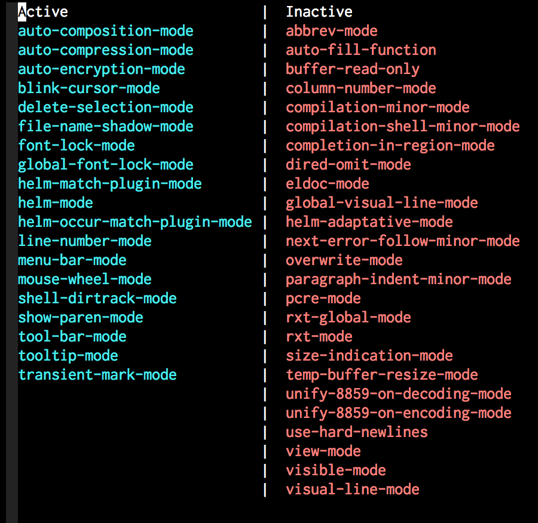

[](https://melpa.org/#/manage-minor-mode)


# Manage your minor-mode on the dedicated interface buffer

<p align="center">
  
</p>

## Usage

1. M-x manage-minor-mode
2. Minor modes list buffer will appear in other window
3. Then type "RET" key on any minor-mode you want to toggle active/inactive

If you want to enable/disable minor-modes on the whole session,
press [e] or [d] on any minor-mode to keep its status even if you change major-modes, buffers, files.
It continues until stopping emacs.
This enable/disable list is stored in the `global` of `manage-minor-mode-default`.
You can also press [r] on any minor-mode to eliminate out of the list.

## Set minor-modes status for each major-mode in advance

```el
(setq manage-minor-mode-default
      '((global
         (on   rainbow-mode)
         (off  line-number-mode))
        (emacs-lisp-mode
         (on   rainbow-delimiters-mode eldoc-mode show-paren-mode))
        (js2-mode
         (on   color-identifiers-mode)
         (off  flycheck-mode))))
```

## Show keybinding

Default value of `manage-minor-mode-always-show-keybind` is t.
If you want to hide keybinding info displaying on the top of the buffer,
set this value nil like below.

```el
(setq manage-minor-mode-always-show-keybind nil)
```


## Eradicate all minor-modes

When you in the target buffer or "*manage-minor-mode*" buffer,
M-x `manage-minor-mode-bals` to disable all minor-modes.
M-x `manage-minor-mode-restore-from-bals` to restore the minor-modes before `manage-minor-mode-bals` done.
It might be useful when you view a huge size file smoothly.

List minor-modes that exception from `manage-minor-mode-bals` like below.

```el
(setq manage-minor-mode-bals-exclude-list
      '((global (recentf-mode global-font-lock-mode delete-selection-mode transient-mark-mode tabbar-mode))
        (text-mode (line-number-mode))
        (org-mode (line-number-mode blink-cursor-mode))))
```


## Mouse menu

You can click minor-mode indicated in the mode-line to pop up manage-minor-mode menu item.


